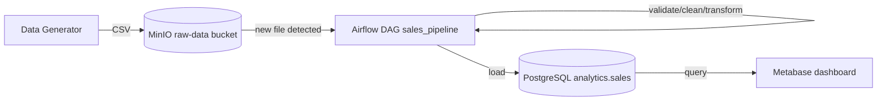

# Mini Data Platform

An end-to-end, Dockerized data platform that generates synthetic sales data,
lands it in object storage, orchestrates cleaning/transformation/loading with
Airflow, stores the result in PostgreSQL, and visualizes it in Metabase.

```text
Data Generator -> MinIO -> Airflow -> PostgreSQL -> Metabase
```

## Overview

This project demonstrates a realistic, small-scale data platform built the
way a real one would be: isolated services, environment-driven
configuration, an idempotent orchestrated pipeline, real data-quality
rules, automated tests, and CI. It's sized for a local/academic deployment
rather than production, and the README says explicitly where that trade-off
was made.

## Architecture



All inter-service communication happens over a dedicated Docker bridge
network (`mini-data-platform-net`) using Docker service names
(`postgres`, `minio`, `airflow-webserver`, `airflow-scheduler`, `metabase`)
-- containers never talk to each other over `localhost`. `localhost` is only
used from the host machine (your browser, or scripts run outside Docker) via
the ports published in `docker-compose.yml`.

## Technologies

* Docker & Docker Compose
* PostgreSQL 16 -- analytics store (`analytics.sales`) and, separately, Airflow's own metadata DB
* Apache Airflow 2.9 (TaskFlow API, LocalExecutor)
* MinIO -- S3-compatible object storage
* Metabase -- dashboards/BI
* Python 3.12, pandas, psycopg2, minio-py
* GitHub Actions -- CI

## Repository structure

```text
dags/                   # Airflow DAG + pipeline logic (dags/pipeline/*.py: ingestion,
                         # cleaning, transform, load, validation -- importable and unit-testable
                         # independent of a running Airflow instance)
data_generator/          # Synthetic sales data generator
tests/unit/              # Unit tests (no live services required)
tests/integration/       # Integration tests against a LIVE running platform
scripts/                 # init_minio.py, init_metabase.py, run_pipeline_test.py
config/postgres/init.sql # Analytics schema, bootstrapped on first container start
config/airflow/          # Airflow configuration notes
docker/                  # Dockerfiles (airflow, data_generator, tests)
dashboards/README.md     # Metabase dashboard setup (manual + best-effort automated)
.github/workflows/main.yml  # CI: lint, unit tests, compose validation, image build, integration test
docker-compose.yml
Makefile
```

## Prerequisites

* Docker and Docker Compose v2 (`docker compose version`)
* Python 3.12 (for running the generator/scripts/tests outside their containers)
* `make`

## Installation

```bash
git clone <this-repository>
cd mini-data-platform
cp .env.example .env
pip install -r requirements.txt
```

## Environment configuration

Edit `.env` (copied from `.env.example`) before first run -- in particular
change every `change_me_dev_only` password, and set `AIRFLOW_UID` to your
host user id (`id -u`) on Linux so mounted DAG/log files aren't root-owned.
`.env` is gitignored; never commit it.

## Running the platform

```bash
make build
make up
```

`make up` prints the URLs once containers are started (see "Access
services" below). Give Airflow ~30-60s on first boot -- `airflow-init` has to
migrate the metadata database and create the admin user before the
webserver/scheduler become healthy.

## Generate data

```bash
make generate-data            # data/sales.csv, 1000 rows, seed 42
ROWS=5000 SEED=7 make generate-data
```

Or directly:
```bash
python data_generator/generate_sales.py --rows 1000 --output data/sales.csv --seed 42 --dirty-fraction 0.03
```

## Upload data

```bash
make upload-data              # uploads data/sales.csv to MinIO's incoming/ prefix
```

## Run the pipeline

```bash
make pipeline                 # generate + upload + unpause + trigger the DAG
```

Or watch/trigger it manually in the Airflow UI (see below) -- the DAG id is
`sales_pipeline`.

## Access services

| Service          | URL                          | Default credentials |
|-------------------|-------------------------------|----------------------|
| Airflow webserver | http://localhost:8080         | `admin` / value of `AIRFLOW_ADMIN_PASSWORD` |
| MinIO console     | http://localhost:9001         | `MINIO_ROOT_USER` / `MINIO_ROOT_PASSWORD` |
| MinIO API         | http://localhost:9000          | (S3-compatible) |
| PostgreSQL        | localhost:5432                 | `POSTGRES_USER` / `POSTGRES_PASSWORD` |
| Metabase          | http://localhost:3000          | set on first login |

## Dashboard

See [`dashboards/README.md`](dashboards/README.md) for full setup
instructions and the exact SQL behind each KPI/chart. In short:
`make init-metabase` attempts automated setup (admin account + PostgreSQL
connection); if that doesn't succeed, the manual steps in that file always
work.

## Testing

```bash
make test               # unit tests -- no live services required
make lint                # ruff
make integration-test    # requires `make up` (and ideally `make pipeline` first)
```

## Troubleshooting

* **Port already in use** -- another process (or a previous `docker compose`
  project) is bound to that port. Change the relevant `*_PORT` variable in
  `.env`, or stop the conflicting process.
* **Docker not running** -- start Docker Desktop / the Docker daemon before
  `make build`/`make up`.
* **Airflow webserver unhealthy / stuck starting** -- check
  `docker compose logs airflow-init`; it must complete successfully (DB
  migration + admin user creation) before the webserver/scheduler start.
* **MinIO "access denied"** -- the client (script or app) is using the wrong
  `MINIO_ROOT_USER`/`MINIO_ROOT_PASSWORD`; confirm they match `.env`.
* **PostgreSQL connection refused from Airflow** -- Airflow tasks must
  connect to the `postgres` service name, not `localhost` (see "Networking"
  above).
* **Metabase won't start** -- its embedded H2 database can get into a bad
  state if the container is killed mid-write; as a last resort,
  `docker compose down` then remove the `metabase-data` volume with
  `docker volume rm mini-data-platform_metabase-data` (this deletes
  Metabase's dashboards/config, not your PostgreSQL data) and re-run
  `make init-metabase`.
* **Stale/corrupted volumes after repeated resets** -- `make reset` tears
  down the stack and deletes all named volumes; follow with `make build up`
  for a clean start.

## Architecture decisions

* **Airflow gets its own metadata Postgres**, separate from the analytics
  `postgres` service, matching standard Airflow deployment practice -- the
  orchestrator's internal state shouldn't share a database with the
  business data it's loading.
* **Metabase uses its bundled embedded H2 database** for its own
  application metadata (dashboards, saved questions, users) rather than a
  second PostgreSQL database. This is a deliberate simplification for a
  local/academic deployment (see "Limitations"); the trade-off is that
  Metabase's own config isn't as easily backed up/migrated as it would be
  on Postgres.
* **MinIO new-file detection is bucket-state-driven**: files live under
  `incoming/` and get moved to `processed/` only after a validated load,
  rather than using an external tracking table. This makes the pipeline
  naturally idempotent and keeps "what's new" a pure function of bucket
  state.
* **The load step is an UPSERT keyed on `transaction_id`** (not a plain
  INSERT), so re-running the DAG against a file that partially loaded
  before a failure is safe.
* **Pipeline stage logic lives in `dags/pipeline/*.py`, separate from the
  DAG definition**, specifically so cleaning/transform/validation logic can
  be unit tested with plain pandas DataFrames -- no Airflow runtime needed.

## Data quality rules

Full detail is in the `dags/pipeline/cleaning.py` module docstring; summary:

* **Required and validated**: `transaction_id`, `transaction_date`,
  `customer_id`, `product_id`, `quantity` (coerced to int, must be >= 1),
  `unit_price` (coerced to float, must be >= 0). A row failing any of these
  is **dropped**.
* **Optional categoricals** (`product_category`, `region`,
  `payment_method`): missing values are replaced with `"Unknown"` rather
  than dropping the row, since a malformed category doesn't invalidate the
  transaction itself.
* All string fields are trimmed; categorical fields are normalized to
  Title Case.
* `transaction_id` duplicates are de-duplicated, keeping the first
  occurrence.
* `revenue` is **always recomputed** as `quantity * unit_price` during
  transformation rather than trusted from source, so it can never drift.
* The PostgreSQL schema enforces the same non-negativity constraints via
  `CHECK` constraints as a second line of defense, and
  `validate_loaded_records()` re-checks row count, negative values, null
  required fields, and duplicate IDs after loading, failing the DAG run if
  any check fails.

## CI/CD

`.github/workflows/main.yml` runs three jobs on every push/PR to `main`:

1. **lint-and-unit-test** -- YAML validation, `ruff check`, `pytest tests/unit`.
2. **build-and-validate-compose** -- `docker compose config` and
   `docker compose build` for every service.
3. **integration-test** -- brings the full stack up with
   `docker compose up -d --build` and runs `scripts/run_pipeline_test.py`,
   which waits for all services, generates and uploads test data, triggers
   the DAG via the Airflow REST API, waits for it to finish, and then runs
   `tests/integration`.

## Limitations

* **This repository was implemented and unit-tested in a sandboxed
  environment with no Docker daemon available.** Every Python module
  (generator, cleaning, transform, load, ingestion, validation) was
  actually executed and unit tested (33 unit tests, all passing, against
  mocked MinIO/Postgres clients where a live service would normally be
  used). `docker compose build`/`up`, live Airflow DAG execution, and the
  Metabase dashboard were written and reviewed but **not run end-to-end**
  in this environment. Run `make build up pipeline` and the CI workflow on
  a machine with Docker to get that confirmation.
* Metabase dashboard/card creation is documented manually rather than
  fully API-automated (see `dashboards/README.md` for why).
* Airflow uses `LocalExecutor` -- fine for a single-node local deployment,
  not a horizontally-scaled production setup.
* No authentication/TLS between internal services (MinIO, Postgres) --
  appropriate for local development behind Docker's internal network, not
  for a public deployment.
* The synthetic data generator's "dirty data" is randomly distributed, not
  drawn from a fixed golden fixture, so exact dirty-row counts vary by seed
  (this is intentional -- see "Data quality rules").

## Future improvements

* Switch Airflow to `CeleryExecutor`/`KubernetesExecutor` for horizontal
  scaling.
* Add TLS and per-service credentials/secrets management (e.g. Docker
  secrets or an external secrets manager) instead of plain environment
  variables.
* Add a dbt layer between the raw load and Metabase for versioned,
  testable SQL transformations instead of transforming in Python before load.
* Automate Metabase dashboard/card provisioning fully once a stable,
  version-pinned approach is validated (see `dashboards/README.md`).
* Add data lineage/observability (e.g. OpenLineage) across the MinIO ->
  Airflow -> PostgreSQL hop.
