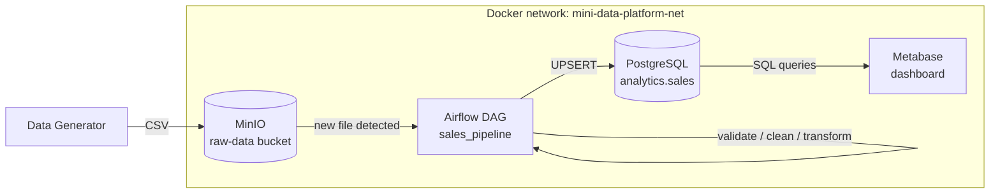
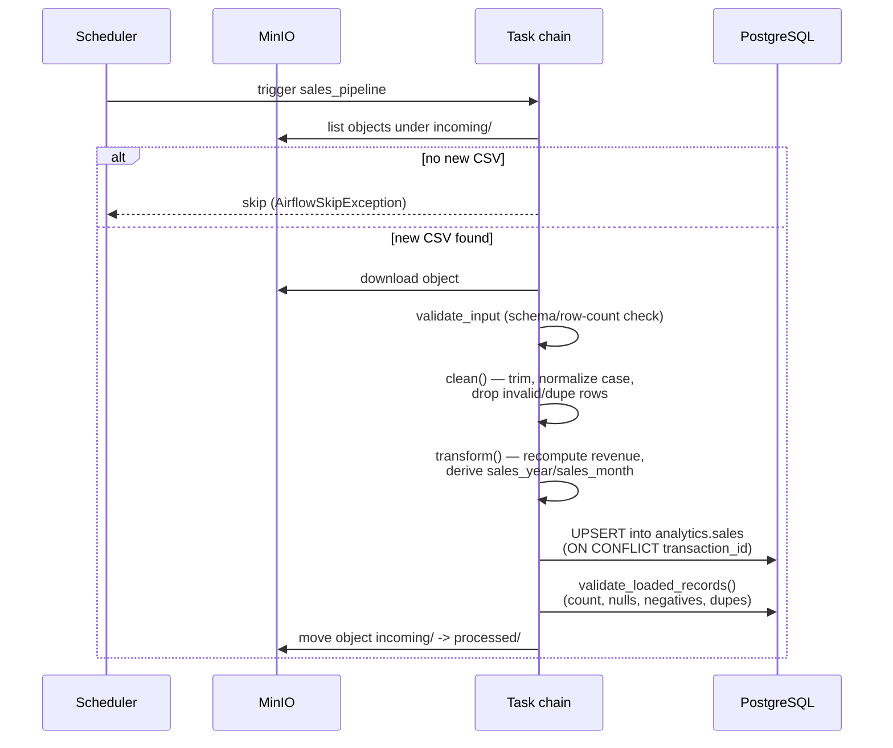
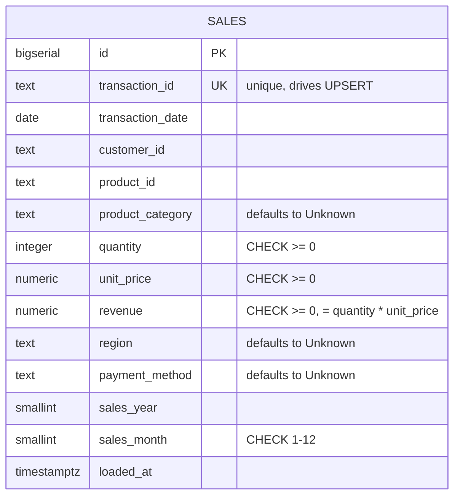
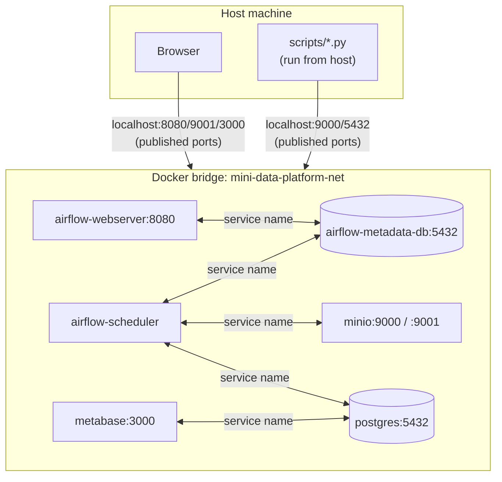

# Architecture — Mini Data Platform

This document describes how the Mini Data Platform is put together: the
overall data flow, the Airflow pipeline internally, the PostgreSQL schema,
the network topology, and the reasoning behind the key design decisions.
It's meant to stand on its own in `docs/` alongside (not duplicating) the
setup/usage instructions in the main [README](../README.md).

## 1. System overview

Four services, one job each:

| Service | Role | Owns |
|---|---|---|
| **Data Generator** | Produces synthetic sales CSVs, including intentional data-quality defects | Nothing persistent — a one-shot script/container |
| **MinIO** | S3-compatible landing zone for raw files | `raw-data` bucket (`incoming/`, `processed/` prefixes) |
| **Airflow** | Orchestrates ingest → validate → clean → transform → load → validate | Its own metadata Postgres, DAG code, task logs |
| **PostgreSQL (analytics)** | Durable store of cleaned, transformed sales data | `analytics.sales` table |
| **Metabase** | Ad-hoc queries and the sales dashboard | Its own embedded app database (dashboards, users) |

## 2. Pipeline internals (sales_pipeline DAG)

The DAG lives in `dags/sales_pipeline.py` and is intentionally thin — it
just wires together pure, independently-testable functions from
`dags/pipeline/*.py`. This split is the single most important structural
decision in the project: every stage below can be unit tested with a plain
pandas `DataFrame` or a mocked client, with no Airflow runtime and no live
MinIO/Postgres required.

Two properties fall out of this shape:

* **Idempotency.** A file only moves to `processed/` after its load has
  been validated. A crash mid-pipeline leaves the file in `incoming/`, so
  the next scheduled run just retries it — no partial-state bookkeeping
  needed. The Postgres UPSERT (keyed on `transaction_id`) means retrying a
  partially-loaded file doesn't create duplicate rows either.
* **Fail-fast, not fail-silent.** `validate_input` and
  `validate_loaded_records` both raise on failure, which fails the Airflow
  task (with retries per `DEFAULT_ARGS`) rather than letting bad data
  proceed quietly to the next stage.

## 3. Data model

Defined in `config/postgres/init.sql`, applied automatically on first
container start via Postgres's `docker-entrypoint-initdb.d` mechanism.
Indexes exist on `transaction_date`, `product_category`, `region`, and the
`(sales_year, sales_month)` pair — the columns the dashboard's KPI/trend
queries actually filter and group on (see `dashboards/README.md`).

## 4. Network topology

The rule of thumb: **inside** the Docker network, services address each
other by service name (`postgres`, `minio`, ...) over the internal Compose
DNS — never `localhost`. **Outside** the network (your browser, or a
Python script run directly on the host rather than in a container), you go
through the published `localhost:<port>` mappings instead. Mixing these up
is the most common source of "connection refused" issues — see the
README's Troubleshooting section.

## 5. Why these specific decisions

* **Airflow's metadata DB is a separate Postgres instance** from the
  analytics DB, not a shared one. Airflow's internal scheduler/task state
  churns constantly and has a different backup/retention story than
  business data — coupling them would be a maintenance liability even at
  this small scale.
* **Metabase uses its bundled H2 file database** for its own app metadata
  rather than a second Postgres database. This trades some
  production-readiness (H2 is harder to back up/migrate than Postgres) for
  meaningfully less docker-compose complexity, which is the right call for
  a local/academic deployment. Documented as a deliberate simplification,
  not an oversight.
* **MinIO ingestion state lives in the bucket itself** (`incoming/` vs
  `processed/` prefixes) instead of a separate tracking table. One less
  moving part, and "what's new" is always answerable by listing the
  bucket — no risk of the tracking table and the bucket disagreeing.
* **Cleaning/transform/load are pure functions taking DataFrames/records
  in and out**, wrapped by thin I/O functions the DAG calls. This is what
  makes the 33-test unit suite possible without spinning up Airflow,
  MinIO, or Postgres for every test run.

## 6. Where to look next

* Step-by-step setup and commands: [`README.md`](../README.md)
* Dashboard build instructions and the exact KPI SQL: [`dashboards/README.md`](../dashboards/README.md)
* Pipeline stage implementations: [`dags/pipeline/`](../dags/pipeline/)
* Schema source of truth: [`config/postgres/init.sql`](../config/postgres/init.sql)
